cyclist_cleaning_and_preparation
================
Adam
2024-06-13

# Contents

- Packages
- Data
- Analysis
- Discussion

# Packages

``` r
library(tidyverse)
library(plotly)
library(readxl)
library(data.table)
library(lubridate)
library(tibble)
library(skimr)
library(here)
library(janitor)
library(car)
```

# Data

``` r
# uploading cleaned data

cyclist_data_cleaned <- read.csv(here("data", "cyclist_data_cleaned.csv"))

chicago_temperatures <- read.csv(here("data", "chicago_weather_monthly_averages.csv"))

# Converting variables to factors

cyclist_data_cleaned$member_casual <- as.factor(cyclist_data_cleaned$member_casual)
cyclist_data_cleaned$rideable_type <- as.factor(cyclist_data_cleaned$rideable_type)
cyclist_data_cleaned$day_of_week <- as.factor(cyclist_data_cleaned$day_of_week)
cyclist_data_cleaned$weekday_weekend <- as.factor(cyclist_data_cleaned$weekday_weekend)
cyclist_data_cleaned$month <- as.factor(cyclist_data_cleaned$month)
cyclist_data_cleaned$time_of_day <- as.factor(cyclist_data_cleaned$time_of_day)
cyclist_data_cleaned$holidays <- as.factor(cyclist_data_cleaned$holidays)
cyclist_data_cleaned$journey_grouping <- as.factor(cyclist_data_cleaned$journey_grouping)
```

``` r
str(cyclist_data_cleaned)
```

    ## 'data.frame':    5674287 obs. of  19 variables:
    ##  $ ride_id         : chr  "0D9FA920C3062031" "92485E5FB5888ACD" "FB144B3FC8300187" "DDEB93BC2CE9AA77" ...
    ##  $ rideable_type   : Factor w/ 3 levels "classic_bike",..: 3 3 3 1 1 1 2 1 1 3 ...
    ##  $ started_at      : chr  "2023-05-07 19:53:00" "2023-05-06 18:54:00" "2023-05-21 00:40:00" "2023-05-10 16:47:00" ...
    ##  $ ended_at        : chr  "2023-05-07 19:58:00" "2023-05-06 19:03:00" "2023-05-21 00:44:00" "2023-05-10 16:59:00" ...
    ##  $ start_lat       : num  41.9 41.9 41.9 41.9 42 ...
    ##  $ start_lng       : num  -87.7 -87.7 -87.6 -87.7 -87.7 ...
    ##  $ end_lat         : num  41.9 41.9 41.9 41.9 41.9 ...
    ##  $ end_lng         : num  -87.7 -87.7 -87.7 -87.7 -87.7 ...
    ##  $ member_casual   : Factor w/ 2 levels "casual","member": 2 2 2 2 2 2 1 2 2 2 ...
    ##  $ date            : chr  "2023-05-07" "2023-05-06" "2023-05-21" "2023-05-10" ...
    ##  $ time            : chr  "19:53" "18:54" "00:40" "16:47" ...
    ##  $ journey_time    : int  300 540 240 720 540 960 2040 300 780 180 ...
    ##  $ day_of_week     : Factor w/ 7 levels "Friday","Monday",..: 4 3 4 7 6 6 6 3 2 1 ...
    ##  $ weekday_weekend : Factor w/ 2 levels "weekday","weekend": 2 2 2 1 1 1 1 2 1 1 ...
    ##  $ month           : Factor w/ 12 levels "April","August",..: 9 9 9 9 9 9 9 9 9 9 ...
    ##  $ time_of_day     : Factor w/ 4 levels "afternoon","evening",..: 2 2 4 1 2 1 1 1 1 4 ...
    ##  $ started_at_date : chr  "2023-05-07" "2023-05-06" "2023-05-20" "2023-05-10" ...
    ##  $ holidays        : Factor w/ 2 levels "holiday","school": 2 2 2 2 2 2 2 2 2 2 ...
    ##  $ journey_grouping: Factor w/ 5 levels "0-10","10-20",..: 1 1 1 2 1 2 4 1 2 1 ...

``` r
skim_without_charts(cyclist_data_cleaned)
```

|                                                  |                      |
|:-------------------------------------------------|:---------------------|
| Name                                             | cyclist_data_cleaned |
| Number of rows                                   | 5674287              |
| Number of columns                                | 19                   |
| \_\_\_\_\_\_\_\_\_\_\_\_\_\_\_\_\_\_\_\_\_\_\_   |                      |
| Column type frequency:                           |                      |
| character                                        | 6                    |
| factor                                           | 8                    |
| numeric                                          | 5                    |
| \_\_\_\_\_\_\_\_\_\_\_\_\_\_\_\_\_\_\_\_\_\_\_\_ |                      |
| Group variables                                  | None                 |

Data summary

**Variable type: character**

| skim_variable   | n_missing | complete_rate | min | max | empty | n_unique | whitespace |
|:----------------|----------:|--------------:|----:|----:|------:|---------:|-----------:|
| ride_id         |         0 |             1 |   8 |  16 |     0 |  5674287 |          0 |
| started_at      |         0 |             1 |  10 |  19 |     0 |   461373 |          0 |
| ended_at        |         0 |             1 |  10 |  19 |     0 |   461522 |          0 |
| date            |         0 |             1 |  10 |  10 |     0 |      366 |          0 |
| time            |         0 |             1 |   5 |   5 |     0 |     1440 |          0 |
| started_at_date |         0 |             1 |  10 |  10 |     0 |      367 |          0 |

**Variable type: factor**

| skim_variable    | n_missing | complete_rate | ordered | n_unique | top_counts                                            |
|:-----------------|----------:|--------------:|:--------|---------:|:------------------------------------------------------|
| rideable_type    |         0 |             1 | FALSE   |        3 | ele: 2871525, cla: 2749931, doc: 52831                |
| member_casual    |         0 |             1 | FALSE   |        2 | mem: 3673224, cas: 2001063                            |
| day_of_week      |         0 |             1 | FALSE   |        7 | Sat: 880051, Thu: 844650, Tue: 826742, Wed: 818081    |
| weekday_weekend  |         0 |             1 | FALSE   |        2 | wee: 4055576, wee: 1618711                            |
| month            |         0 |             1 | FALSE   |       12 | Aug: 761580, Jul: 756610, Jun: 710407, Sep: 658224    |
| time_of_day      |         0 |             1 | FALSE   |        4 | aft: 2509017, eve: 1501377, mor: 1449181, nig: 214712 |
| holidays         |         0 |             1 | FALSE   |        2 | sch: 5195947, hol: 478340                             |
| journey_grouping |         0 |             1 | FALSE   |        5 | 0-1: 3098679, 10-: 1550410, 20-: 549245, 40+: 243893  |

**Variable type: numeric**

| skim_variable | n_missing | complete_rate |   mean |     sd |     p0 |    p25 |    p50 |     p75 |    p100 |
|:--------------|----------:|--------------:|-------:|-------:|-------:|-------:|-------:|--------:|--------:|
| start_lat     |         0 |             1 |  41.90 |   0.04 |  41.63 |  41.88 |  41.90 |   41.93 |   42.07 |
| start_lng     |         0 |             1 | -87.65 |   0.03 | -87.94 | -87.66 | -87.64 |  -87.63 |  -87.46 |
| end_lat       |         0 |             1 |  41.90 |   0.05 |  41.61 |  41.88 |  41.90 |   41.93 |   42.15 |
| end_lng       |         0 |             1 | -87.65 |   0.03 | -87.99 | -87.66 | -87.64 |  -87.63 |  -87.46 |
| journey_time  |         0 |             1 | 803.76 | 757.59 |   0.00 | 300.00 | 600.00 | 1020.00 | 5640.00 |

# Analysis

## Logistic regression to test which variables significantly impact member/casual rates

``` r
# Final model

# weekday vs weekend was removed as it was derived from day of the week and caused collinearity
# holidays vs term time was removed as it was the only non-significant factor and helped reduce model complexity and memory use

cyclistic_logistic_regression_model <- glm(member_casual ~ rideable_type + journey_time + day_of_week + month +
                                             time_of_day + journey_grouping,
                                           data = cyclist_data_cleaned, family = binomial)

summary(cyclistic_logistic_regression_model)
```

    ## 
    ## Call:
    ## glm(formula = member_casual ~ rideable_type + journey_time + 
    ##     day_of_week + month + time_of_day + journey_grouping, family = binomial, 
    ##     data = cyclist_data_cleaned)
    ## 
    ## Coefficients:
    ##                              Estimate Std. Error  z value Pr(>|z|)    
    ## (Intercept)                 1.350e+00  4.787e-03  281.950  < 2e-16 ***
    ## rideable_typedocked_bike   -1.566e+01  5.851e+00   -2.676  0.00745 ** 
    ## rideable_typeelectric_bike -3.351e-01  1.878e-03 -178.429  < 2e-16 ***
    ## journey_time               -5.812e-04  4.266e-06 -136.243  < 2e-16 ***
    ## day_of_weekMonday           1.641e-01  3.534e-03   46.431  < 2e-16 ***
    ## day_of_weekSaturday        -3.406e-01  3.284e-03 -103.737  < 2e-16 ***
    ## day_of_weekSunday          -3.017e-01  3.443e-03  -87.623  < 2e-16 ***
    ## day_of_weekThursday         2.109e-01  3.436e-03   61.372  < 2e-16 ***
    ## day_of_weekTuesday          2.569e-01  3.481e-03   73.802  < 2e-16 ***
    ## day_of_weekWednesday        2.654e-01  3.491e-03   76.044  < 2e-16 ***
    ## monthAugust                -3.518e-01  4.269e-03  -82.404  < 2e-16 ***
    ## monthDecember               3.332e-01  6.224e-03   53.536  < 2e-16 ***
    ## monthFebruary               3.789e-01  6.395e-03   59.245  < 2e-16 ***
    ## monthJanuary                6.070e-01  7.986e-03   76.009  < 2e-16 ***
    ## monthJuly                  -3.959e-01  4.253e-03  -93.091  < 2e-16 ***
    ## monthJune                  -3.628e-01  4.308e-03  -84.204  < 2e-16 ***
    ## monthMarch                  1.723e-01  5.483e-03   31.428  < 2e-16 ***
    ## monthMay                   -2.632e-01  4.467e-03  -58.930  < 2e-16 ***
    ## monthNovember               1.014e-01  5.197e-03   19.511  < 2e-16 ***
    ## monthOctober               -1.298e-01  4.604e-03  -28.183  < 2e-16 ***
    ## monthSeptember             -2.991e-01  4.364e-03  -68.528  < 2e-16 ***
    ## time_of_dayevening         -6.607e-02  2.236e-03  -29.548  < 2e-16 ***
    ## time_of_daymorning          3.264e-01  2.371e-03  137.628  < 2e-16 ***
    ## time_of_daynight           -2.957e-01  4.738e-03  -62.409  < 2e-16 ***
    ## journey_grouping10-20       9.471e-03  3.106e-03    3.050  0.00229 ** 
    ## journey_grouping20-30       1.174e-01  5.741e-03   20.454  < 2e-16 ***
    ## journey_grouping30-40       2.568e-01  8.682e-03   29.579  < 2e-16 ***
    ## journey_grouping40+         1.152e-01  1.319e-02    8.733  < 2e-16 ***
    ## ---
    ## Signif. codes:  0 '***' 0.001 '**' 0.01 '*' 0.05 '.' 0.1 ' ' 1
    ## 
    ## (Dispersion parameter for binomial family taken to be 1)
    ## 
    ##     Null deviance: 7366069  on 5674286  degrees of freedom
    ## Residual deviance: 6816545  on 5674259  degrees of freedom
    ## AIC: 6816601
    ## 
    ## Number of Fisher Scoring iterations: 14

- Exploration of results from the model above impacting member/casual
  likelihood are explored below

### Months of the year significantly impacted odds of being a member

``` r
# plot: user proportions by month

ggplot(combined_rides_month, aes(x = month)) +
  geom_col(aes(y = proportion, fill = "Casual"), position = "stack") +
  geom_col(aes(y = member_proportion, fill = "Member"), position = "stack") +
  labs(title = "User proportions from May 2023 to April 2024",
       x = NULL,
       y = "User Proportions",
       fill = "") +
  theme_minimal()+
  theme(axis.text.x = element_text(angle = 45, hjust = 0.6))+
  scale_fill_manual(values = c("Member" = "#023047", "Casual" = "#ffb703"))+
  annotate(geom = "text", x = 1, y = 92, label = "38%", size = 4, angle = 45)+
  annotate(geom = "text", x = 2, y = 92, label = "41%", size = 4, angle = 45)+
  annotate(geom = "text", x = 3, y = 92, label = "43%", size = 4, angle = 45)+
  annotate(geom = "text", x = 4, y = 92, label = "40%", size = 4, angle = 45)+
  annotate(geom = "text", x = 5, y = 92, label = "39%", size = 4, angle = 45)+
  annotate(geom = "text", x = 6, y = 92, label = "33%", size = 4, angle = 45)+
  annotate(geom = "text", x = 7, y = 92, label = "27%", size = 4, angle = 45)+
  annotate(geom = "text", x = 8, y = 92, label = "23%", size = 4, angle = 45)+
  annotate(geom = "text", x = 9, y = 92, label = "17%", size = 4, angle = 45)+
  annotate(geom = "text", x = 10, y = 92, label = "21%", size = 4, angle = 45)+
  annotate(geom = "text", x = 11, y = 92, label = "27%", size = 4, angle = 45)+
  annotate(geom = "text", x = 12, y = 92, label = "31%", size = 4, angle = 45)
```

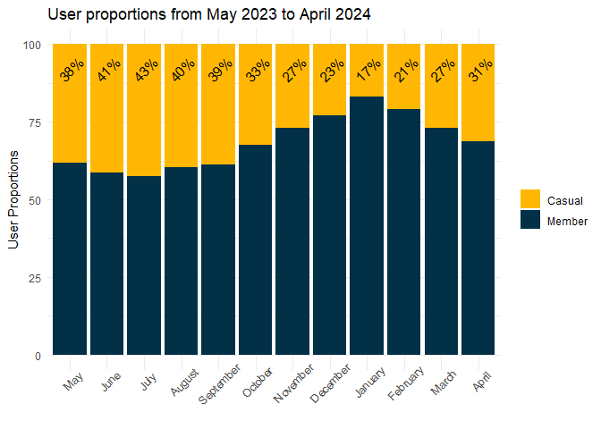<!-- -->

- We see here that there is a steady trend for increasing proportion of
  casual rides from Jan - July  
- This is followed by a steady decline in proportion of casual use form
  July - Jan

``` r
# plot: ride count per month

ggplot(combined_rides_month_pivotted, aes(x = month, y = rides/1000, fill = membership_type))+
  geom_col(position = "dodge", width = 0.7)+
  scale_fill_manual(values = c("member_rides" = "#023047", "casual_rides" = "#ffb703"))+
  labs(title = "Ride count of users by month: May 2023 to April 2024",
       x = NULL,
       y = "Number of rides (in thousands)",
       fill = "") +
  theme_minimal()+
  theme(axis.text.x = element_text(angle = 45, hjust = 0.6))
```

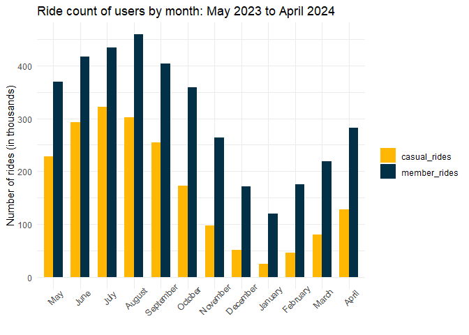<!-- -->

- This is in conjunction with an increase in total rides from Jan - Aug
  and decrease in rides from Aug - Jan

### Is temperature a potential explanatory factor for increased casual use over summer months?

``` r
# correlation of temperature and proportion of casual riders
cor(combined_rides_month$Temp, combined_rides_month$casual_proportion)
```

    ## [1] 0.9795572

- a very strong positive correlation between temperature and proportion
  of casual users

``` r
# regression for relationship between temperature and proportion of casual riders
test_model <- lm(casual_proportion ~ Temp, data = combined_rides_month)
summary(test_model)
```

    ## 
    ## Call:
    ## lm(formula = casual_proportion ~ Temp, data = combined_rides_month)
    ## 
    ## Residuals:
    ##     Min      1Q  Median      3Q     Max 
    ## -2.9779 -0.6096 -0.2675  1.2111  3.1829 
    ## 
    ## Coefficients:
    ##             Estimate Std. Error t value Pr(>|t|)    
    ## (Intercept) 22.08425    0.81125   27.22 1.04e-10 ***
    ## Temp         0.86032    0.05587   15.40 2.72e-08 ***
    ## ---
    ## Signif. codes:  0 '***' 0.001 '**' 0.01 '*' 0.05 '.' 0.1 ' ' 1
    ## 
    ## Residual standard error: 1.834 on 10 degrees of freedom
    ## Multiple R-squared:  0.9595, Adjusted R-squared:  0.9555 
    ## F-statistic: 237.1 on 1 and 10 DF,  p-value: 2.717e-08

``` r
 # plot: temperature against proportion of casual riders
ggplot(data = combined_rides_month, aes(x = Temp, y = casual_proportion))+
  geom_point()+
  geom_smooth(method = "lm")+
  labs(title = "Relationship between monthly average temperature and proportion of casual users",
       x = "Temperature (°C)",
       y = "Proportion of casual riders (%)")+
  theme_minimal()+
  annotate(geom = "text", x = 18, y = 35, label = expression(paste("R"^2, " = 0.9555")), size = 4, angle = 29)
```

    ## `geom_smooth()` using formula = 'y ~ x'

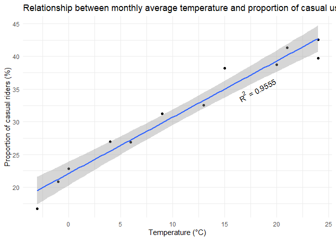<!-- -->

This regression model and plot suggest a strong and significant
relationship (p = 2.717e-08) between temperature and casual user
proportion with the model explaining 96% of the observed variance in the
data. For each degree increase in temperature (C) the proportion of
casual use increases by roughly 0.9%

### Day of the week significantly impacted odds of being a member

``` r
# plot: user proportion by day of the week

ggplot(combined_rides_day_of_week, aes(x = day_of_week)) +
  geom_col(aes(y = proportion, fill = "Casual"), position = "stack") +
  geom_col(aes(y = member_proportion, fill = "Member"), position = "stack") +
  labs(title = "User proportions by day of the week: May 2023 to April 2024",
       x = NULL,
       y = "User Proportions",
       fill = "") +
  theme_minimal()+
  theme(axis.text.x = element_text(angle = 45, hjust = 0.6))+
  scale_fill_manual(values = c("Member" = "#023047", "Casual" = "#ffb703"))+
  annotate(geom = "text", x = 1, y = 92, label = "32%", size = 4, angle = 45)+
  annotate(geom = "text", x = 2, y = 92, label = "29%", size = 4, angle = 45)+
  annotate(geom = "text", x = 3, y = 92, label = "29%", size = 4, angle = 45)+
  annotate(geom = "text", x = 4, y = 92, label = "30%", size = 4, angle = 45)+
  annotate(geom = "text", x = 5, y = 92, label = "36%", size = 4, angle = 45)+
  annotate(geom = "text", x = 6, y = 92, label = "46%", size = 4, angle = 45)+
  annotate(geom = "text", x = 7, y = 92, label = "45%", size = 4, angle = 45)
```

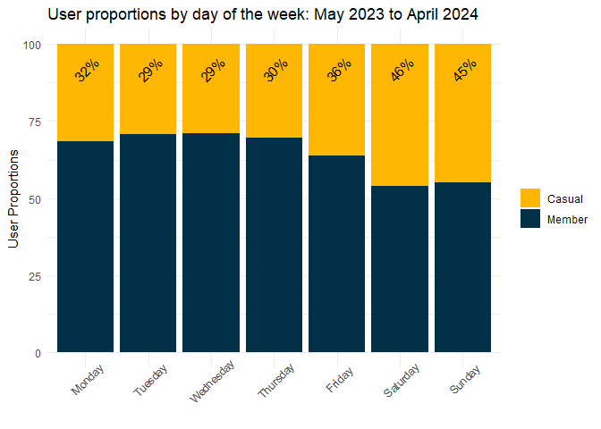<!-- -->

- Casual riders make up a larger proportion of riders on the weekend  
- Slightly more casual riders on Fridays and Monday, could be a result
  of bank holiday weekends which were not assessed  
- These results were also visible in the weekday/weekend split which was
  removed from the logistic regression model

``` r
# plot: rides per day for days of the week

ggplot(combined_rides_day_pivotted, aes(x = day_of_week, y = rides/1000, fill = membership_type))+
  geom_col(position = "dodge", width = 0.7)+
  scale_fill_manual(values = c("member_rides" = "#023047", "casual_rides" = "#ffb703"))+
  labs(title = "Ride count of users by day of week: May 2023 to April 2024",
       x = NULL,
       y = "Number of rides (in thousands)",
       fill = "") +
  theme_minimal()+
  theme(axis.text.x = element_text(angle = 45, hjust = 0.6))
```

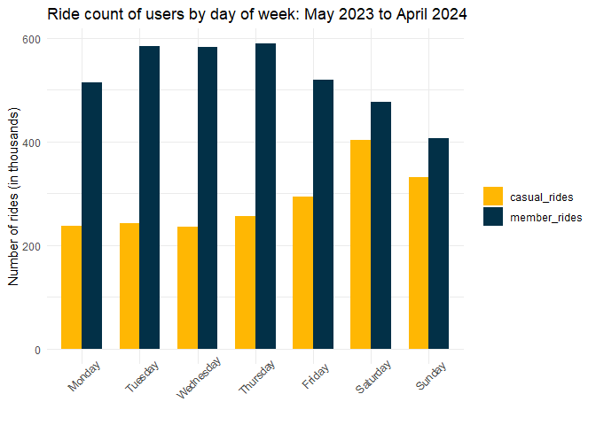<!-- -->

- The difference in casual use proportion at the weekend comes as a
  result of both casual use increase and member use decrease

### Time of day significantly impacted odds of being a member

``` r
# user proportion by time of day

ggplot(combined_rides_per_time_of_day, aes(x = time_of_day)) +
  geom_col(aes(y = proportion, fill = "Casual"), position = "stack") +
  geom_col(aes(y = member_proportion, fill = "Member"), position = "stack") +
  labs(title = "User proportions by time of day: May 2023 to April 2024",
       x = NULL,
       y = "User Proportions",
       fill = "") +
  theme_minimal()+
  scale_fill_manual(values = c("Member" = "#023047", "Casual" = "#ffb703"))+
  scale_x_discrete(labels = c("Morning\n(06:00-11:59)", "Afternoon\n(12:00-17:59)", "Evening\n(18:00-23:59)", "Night\n(00:00-05:59)"))+
  annotate(geom = "text", x = 1, y = 92, label = "28%", size = 4, angle = 45)+
  annotate(geom = "text", x = 2, y = 92, label = "37%", size = 4, angle = 45)+
  annotate(geom = "text", x = 3, y = 92, label = "38%", size = 4, angle = 45)+
  annotate(geom = "text", x = 4, y = 92, label = "45%", size = 4, angle = 45)
```

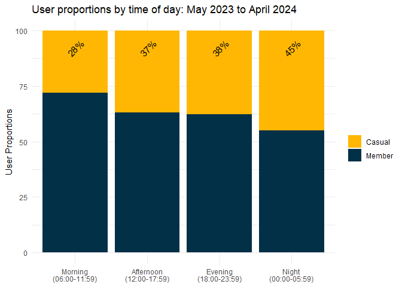<!-- -->

- The proportion of casual users is lowest in the morning, increases for
  afternoon and evening and then peaks after midnight

``` r
# ride numbers at different times of the day

ggplot(combined_rides_per_time_of_day_pivotted, aes(x = time_of_day, y = rides/1000, fill = membership_type))+
  geom_col(position = "dodge", width = 0.7)+
  scale_fill_manual(values = c("member_rides" = "#023047", "casual_rides" = "#ffb703"))+
  labs(title = "Ride count of users by time of day: May 2023 to April 2024",
       x = NULL,
       y = "Number of rides (in thousands)",
       fill = "") +
  theme_minimal()+
  scale_x_discrete(labels = c("Morning\n(06:00-11:59)", "Afternoon\n(12:00-17:59)", "Evening\n(18:00-23:59)", "Night\n(00:00-05:59)"))
```

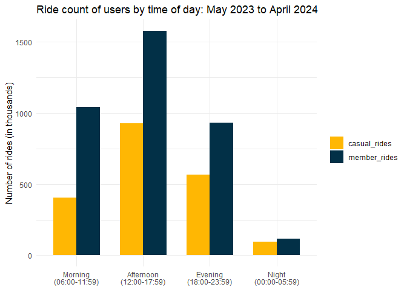<!-- -->

- peak bike usage occurs in the afternoon between 12:00 and 17:59.  
- though the highest proportion of casual users is after midnight it
  will likely be ineffective to target this for conversion of casual
  users to members as there a significantly less rides occurring over
  between the hours of 00:00 and 05:59

### Journey length significantly impacted the odds of being a member

``` r
# plot: journey time split by user type

ggplot(cyclist_data_cleaned, aes(x = journey_time/60, fill = member_casual)) +
  geom_density(alpha = 0.5, adjust = 10) +
  labs(title = "Density Plot of Journey Time by User Type",
       x = "Journey Time (minutes)",
       y = "Density",
       fill = "") +
  theme_minimal()+
  scale_fill_manual(values = c("member" = "#023047", "casual" = "#ffb703"))
```

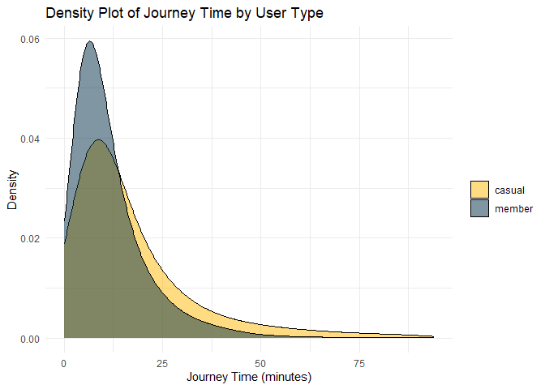<!-- -->

- Casual users have slightly longer journey times than members
- The total number of journeys decreases with increasing journey length

### Journey length groupings also expressed the same change in odds of being a member

Grouping into journey times helps to convert the informmation into an
actionable decision

``` r
# member vs casual journey times grouped

ggplot(combined_rides_per_journey_grouping, aes(x = journey_grouping)) +
  geom_col(aes(y = proportion, fill = "Casual"), position = "stack") +
  geom_col(aes(y = member_proportion, fill = "Member"), position = "stack") +
  labs(title = "User proportions by journey length: May 2023 to April 2024",
       x = "Journey length (minutes)",
       y = "User Proportions",
       fill = "") +
  theme_minimal()+
  scale_fill_manual(values = c("Member" = "#023047", "Casual" = "#ffb703"))+
  annotate(geom = "text", x = 1, y = 92, label = "29%", size = 4, angle = 45)+
  annotate(geom = "text", x = 2, y = 92, label = "37%", size = 4, angle = 45)+
  annotate(geom = "text", x = 3, y = 92, label = "44%", size = 4, angle = 45)+
  annotate(geom = "text", x = 4, y = 92, label = "50%", size = 4, angle = 45)+
  annotate(geom = "text", x = 5, y = 92, label = "70%", size = 4, angle = 45)
```

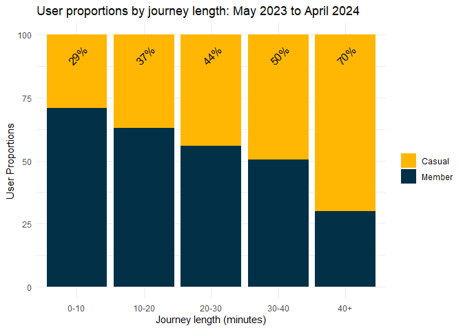<!-- -->

- Casual members account for higher portions of rides as journey length
  increases

``` r
# plot: ride counts per journey length grouping
ggplot(combined_rides_per_journey_grouping_pivotted, aes(x = journey_grouping, y = rides/1000, fill = membership_type))+
  geom_col(position = "dodge", width = 0.7)+
  scale_fill_manual(values = c("member_rides" = "#023047", "casual_rides" = "#ffb703"))+
  labs(title = "Ride count of users by journey length: May 2023 to April 2024",
       x = "Journey length (minutes)",
       y = "Number of rides (in thousands)",
       fill = "") +
  theme_minimal()
```

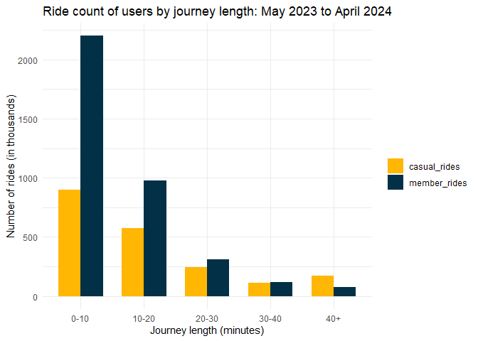<!-- -->

- This clearly shows that a large portion of the current usage is short
  journeys by members  
- Casual riders become a higher proportion of rides as journey become
  longer
- The total number of journeys decreases with increasing journey length
- Targeting higher journey times may bring in casual riders to
  memberships however, those journey types are far less frequent

### Bike type preference differed significantly between casual and member users

``` r
# plot: user proportions for bike types

ggplot(combined_rides_per_bike_type, aes(x = rideable_type)) +
  geom_col(aes(y = proportion, fill = "Casual"), position = "stack") +
  geom_col(aes(y = member_proportion, fill = "Member"), position = "stack") +
  labs(title = "User proportions by bike type: May 2023 to April 2024",
       x = "Bike type",
       y = "User Proportions",
       fill = "") +
  theme_minimal()+
  scale_fill_manual(values = c("Member" = "#023047", "Casual" = "#ffb703"))+
  scale_x_discrete(labels = c("Classic", "Electric"))+
  annotate(geom = "text", x = 1, y = 92, label = "32%", size = 4, angle = 45)+
  annotate(geom = "text", x = 2, y = 92, label = "37%", size = 4, angle = 45)
```

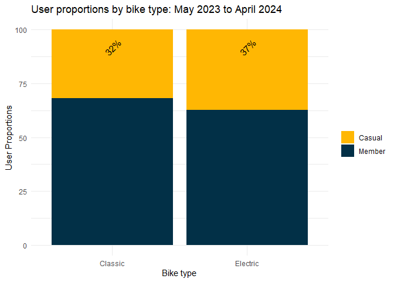<!-- -->

- casual users have a slight preference for electric bikes

### School holidays did not significantly impacted odds of being a member

``` r
# plot: user proportion by holidays vs term time

ggplot(combined_rides_holidays, aes(x = holidays)) +
  geom_col(aes(y = proportion, fill = "Casual"), position = "stack") +
  geom_col(aes(y = member_proportion, fill = "Member"), position = "stack") +
  labs(title = "User proportions during school/holiday time: May 2023 to April 2024",
       x = NULL,
       y = "User Proportions (%)",
       fill = "") +
  theme_minimal()+
  scale_fill_manual(values = c("Member" = "#023047", "Casual" = "#ffb703"))+
  scale_x_discrete(labels = c("School Holidays", "Term Time"))+
  scale_y_continuous(breaks = seq(0, 100, by = 20))+
  annotate(geom = "text", x = 1, y = 92, label = "34.9%%", size = 4, angle = 45)+
  annotate(geom = "text", x = 2, y = 92, label = "35.3%%", size = 4, angle = 45)
```

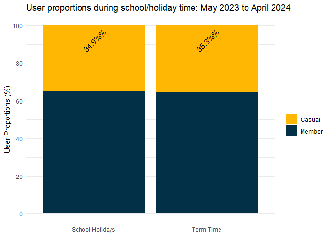<!-- -->

- Users proportion remain consistent between term and holiday periods

``` r
# plot: rides per day in holiday and term time

ggplot(combined_rides_holidays_pivotted, aes(x = holidays, y = rides, fill = membership_type))+
  geom_col(position = "dodge", width = 0.7)+
  scale_fill_manual(values = c("member_rides_per_day" = "#023047", "casual_rides_per_day" = "#ffb703"),
                    labels = c("Casual", "Member"))+
  labs(title = "Daily ride count of users by term time: May 2023 to April 2024",
       x = NULL,
       y = "Number of rides per day",
       fill = "") +
  theme_minimal()+
  scale_x_discrete(labels = c("School Holidays", "Term Time"))
```

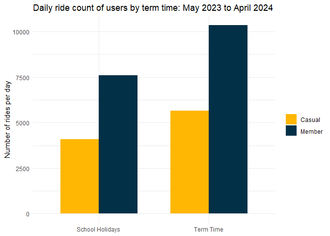<!-- -->

- Use of bikes is higher during term time for both casual users and
  members

## Assessing the lat/lng location data

### Comparing starting locations between member and casual users

<figure>
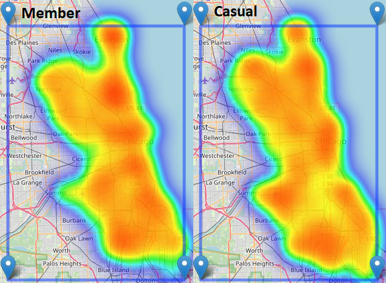
<figcaption aria-hidden="true">starting locations heat map</figcaption>
</figure>

- Regarding points of interest, it appears there are more casual rides
  starting at the Chicago Midway International Airport

### Comparing ending locations between member and casual users

<figure>
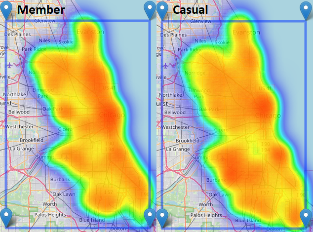
<figcaption aria-hidden="true">Ending locations heat map</figcaption>
</figure>

- Similar to journey starting points, there are more casual rides ending
  at the Chicago Midway International Airport

# Discussion

## Process Summary

- A large percentage (~99%) of the data was retained after cleaning, so
  findings can be considered reliable and representative of the user
  base

- The available data and collection of other data sources such as
  holiday dates and monthly temperatures allowed for the calculation of
  numerous metrics, many of which were influential factors in the
  likelihood of a person being a member/casual user

- Data was modeled to identify significant findings and visuals with
  brief comments were provided to describe those findings

## Finding Summary

Aspects which impacted the likelihood of being a casual user (the target
group) were:

- **Month of the year:** Summer months and higher temperature led to a
  higher proportion of casual use

- **Day of the week:** Weekends showed a higher proportion of casual use

- **Time of day:** Morning had the lowest proportion of casual use while
  proportion of casual use was highest between 00:00 and 05:59

- **Journey length:** Casual users were more likely to have longer
  journey times

- **Bike type:** Casual users has a slight preference for electric bikes

- **Journey locations:** It appears that casual journeys to and from the
  airport are more common in comparison to member routes

## Caveats

- Data over the previous year was missing some information provided in
  previous data sets such as age and gender so their influence was not
  assessed here

- As no account ID was included in the data set, it means some of these
  journeys may be attributed to the same individual, which could impact
  the findings

- This data only encompasses one year so there may be trends specific to
  this year that do not appear across multiple years

- Location analysis was based solely on observations from heat maps.
  These maps (constructed using the ‘leaflet’ package) were not directly
  included in reports due to the intensive rendering requirements of
  interactive maps.

## Recommendations

Though many of the metrics generated here identified scenarios which
have higher casual use and could potentially be targets for conversion
of casual users to members, some of these scenarios would have a much
better return on investment based largely on the number of rides
occurring in those scenarios. As a prime example of this, the highest
proportion of casual use observed in the data set (70%) was from
journeys lasting longer than 40 minutes. Though at first glance it might
seem perfect to offer promotions linked with membership for journeys
over 40 minutes, these journeys only reflect 3% of all journeys and
would therefore not net many new customers even if effective. With that
in mind, the following are likely to be the best targets for conversion
to memberships:

1.  Promotions targeting summer months, specifically May through to
    September will target time periods with roughly 40% casual use in
    combination with these months having the highest user numbers of the
    whole year.

2.  With a very strong relationship between proportion of casual users
    and temperature, where more casual users use the service in higher
    temperatures, a short term promotion could be preemptively prepared
    to go into effect when there are predictions of incoming hot
    weather.

3.  Causal use is much higher on weekends with total rides on weekend
    days remaining equivalent to weekdays, so a promotion during
    weekends, or memberships specifically for weekends, may convert a
    substantial number of users to members.

- Further analysis for inclusion of Friday evening/night in this
  membership may be useful here to see if it could boost the
  appeal/conversion

Other smaller scale conversions to memberships could be made by the
following scenarios:

1.  Promotions for journey lengths above 20 minutes.

2.  Promotions for use of electric bikes.

3.  Promotions for journeys to and from the airport.
